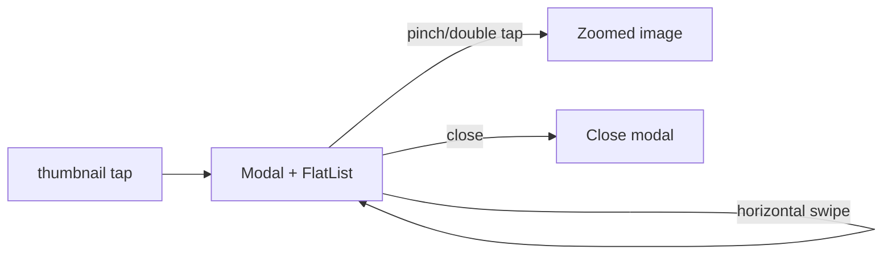

## Plan: Custom FlatList Image Viewer (no flash)

- Replace `react-native-image-viewing` usage with a custom fullscreen modal built on `Modal + FlatList` (horizontal, pagingEnabled) so the surface stays mounted while swiping.
- Implement per-image pinch + double-tap zoom via `react-native-gesture-handler` (PinchGestureHandler, TapGestureHandler) and Animated, with scale clamped and reset on release.
- Keep existing UI affordances: close button top-left with safe-area insets; bottom pager text + dots; no share/download.
- Maintain `onIndexChange` contract to sync with `ItemDetailsScreen` without causing parent re-renders during swipes.
