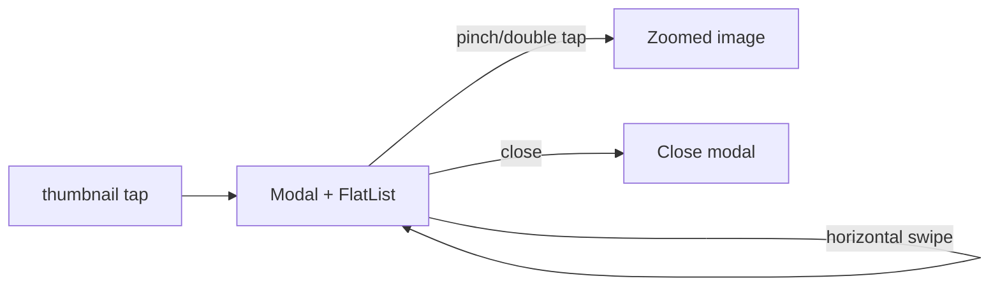

## Plan: Custom FlatList Image Viewer (no flash)

- Replace `react-native-image-viewing` with a custom fullscreen modal using `Modal + FlatList` (horizontal, pagingEnabled) so the surface stays mounted while swiping.
- Implement per-image pinch + double-tap zoom via `react-native-gesture-handler` (PinchGestureHandler, TapGestureHandler) with Animated scale clamp/reset.
- Keep existing UI: safe-area close button top-left; bottom pager text + dots; no share/download.
- Preserve `onIndexChange` so ItemDetailsScreen stays synced without parent re-renders.
